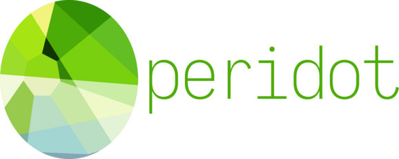

An experimental language for exploring the practical applications of two level type theory.

Discussion takes place on the [r/ProgrammingLanguages Discord server](https://discord.gg/jFZ8JyUNtn) in the #peridot channel.

### References and Inspiration

* [REFERENCES.md](./REFERENCES.md): A list of prior art that have influenced Peridot's design and implementation in major ways

### Information

* [RATIONALE.md](./notes/RATIONALE.md): An in-depth explanation of Peridot's design rationale
* [OLD_VS_NEW.md](./notes/OLD_VS_NEW.md): A comparison of Peridot and [Konna](https://github.com/eashanhatti/konna), a previous project of mine also based on 2LTT

### Introduction

Peridot is a language that allows the compiler backend to be written entirely in userspace. Peridot is split into two languages: one for metaprogramming (the metalanguage) and one for "regular" programming (the object language). The metalanguage is a logic language akin to λProlog, while the object language is a dependently typed functional language akin to Idris and Haskell. Metaprograms deal with compiling and optimizing the second language into a chosen target language - importantly, logic programming allows these metaprograms to be extremely declarative, making compilers and optimizers easy to write. Unlike languages where the backend is built-in to the compiler, optimizations to the object language can be easily added since those optimizations are expressed purely in userspace. Programmers can not only write high-level programs, but also describe how to compile those programs to performant, low-level code.
